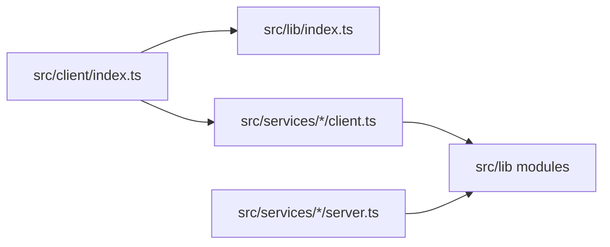
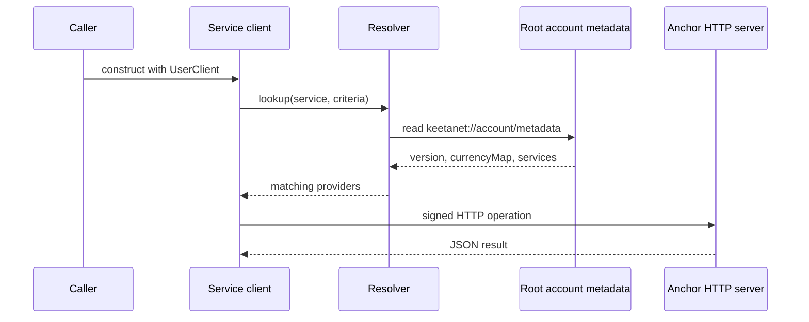

# Architecture

## Abstract

The Anchor SDK turns on-chain service metadata into clients and HTTP servers. A client finds a provider, signs a request, and reads status. This document states what is always true along that path, and where each guarantee is enforced.

## Purpose

This document serves the engineer who integrates a client, and the engineer who implements a service. Both leave it able to name the component that answers a question, and the invariant that a failure violated.

## Related documents

- [Overview](README.md) for the cultural map and first-week reading order.
- [Quickstart](QUICKSTART.md) for install and first client use.
- [Resolver](concepts/resolver.md) for root metadata, lookup, and signatures.
- [Certificates](concepts/certificates.md) for KYC attributes and share containers.
- [Encrypted containers](concepts/encrypted-containers.md) for principal encryption and encoded buffers.
- [Signed URLs](concepts/signed-urls.md) for HTTP query signatures.
- [Queue](concepts/queue.md) for durable jobs and pipes.
- [Status](concepts/status.md) for standardized transfer status.
- [History](concepts/history.md) for classifiers and enrichment.
- [Services](concepts/services.md) for the client, server, and common split.

## Invariants

These statements hold across the package. Each one has a single enforcement point. The concept pages carry the reasoning.

| Invariant | Enforced by |
| --- | --- |
| The published client entry exports `KYC`, `FX`, `AssetMovement`, `Username`, `Notification`, `lib`, and `KeetaNet`. | `src/client/index.ts` |
| Resolver root metadata must carry `version` `1`. | `#getRootMetadata` in `src/lib/resolver.ts` |
| When several roots merge, the earlier root wins a colliding key. | `#mergeRootMetadata` in `src/lib/resolver.ts` |
| A signed service entry carries both `account` and `signed`, or it carries neither. | `verifyServiceEntrySignature` in `src/lib/resolver.ts` |
| Only the status string `COMPLETE` is a settled transfer. | `isCompletedTransferStatus` in `src/lib/anchor-status.ts` |
| A status cache stores a result only after that result is `COMPLETE`. | `AnchorTransactionStatus.getStatus` in `src/lib/anchor-status.ts` |
| History trusts a declared anchor when the block is perspective-owned or the envelope is anchor-signed. | `#enrichBlock` in `src/lib/history.ts` |
| A queue `add` with an existing `id` leaves the stored row unchanged. | `KeetaAnchorQueueStorageDriver.add` in `src/lib/queue/index.ts` |
| A queue status write fails when `oldStatus` does not match. | `Errors.IncorrectStateAssertedError` in `src/lib/queue/common.ts` |
| A runner may pipe only `completed` and `failed_permanently` entries. | `keetaAnchorPipeableQueueStatuses` in `src/lib/queue/index.ts` |
| Authenticated HTTP query fields are `signed.nonce`, `signed.timestamp`, `signed.signature`, and `account`. | `addSignatureToURL` in `src/lib/http-server/common.ts` |
| A service metadata signature covers `namespace`, `account`, `operations`, and optional `legal`. | `extractSignedFields` in `src/lib/anchor-metadata-server.ts` |
| A `SensitiveAttribute` encrypts to the certificate subject. | `CertificateBuilder.setSensitiveAttribute` in `src/lib/certificates.ts` |

`src/lib/resolver.test.ts` exercises metadata lookup and signatures. `src/lib/anchor-status.test.ts` exercises the `COMPLETE` cache. `src/lib/history.test.ts` exercises enrichment and fold. `src/lib/queue/index.test.ts` exercises driver compare-and-set and pipes.

## Client, library, and server

Two barrels organize published types.

| Barrel | Role |
| --- | --- |
| `src/client/index.ts` | The consumer client entry. |
| `src/lib/index.ts` | Certificates, resolver, URI, encrypted container, external envelopes, status, and history. |

A service process imports server classes from `src/services/*/server.ts`. Those classes are not on the client barrel. A `Storage` client lives under `src/services/storage` and is not on the client barrel.

`src/lib/chaining.ts` composes FX hops and asset-movement hops for in-repository flows. It is not on the `lib` barrel. The source is the home for that composer.

## The discovery path

A client does not hard-code a provider URL. It resolves one.

`getDefaultResolver` in `src/config.ts` builds a resolver whose `root` is the network account. A test or a deployment that publishes metadata on another account passes `root` on the client config. [Resolver](concepts/resolver.md) holds the merge and signature rules.

## The process boundary

A published consumer process runs a client. An Anchor operator process runs a server, and often a queue runner.

| Process | What it runs |
| --- | --- |
| Client | Resolver reads, signed HTTP, status, and history. |
| HTTP server | `KeetaNetAnchorHTTPServer` in `src/lib/http-server/index.ts` plus a service subclass. |
| Worker | `KeetaAnchorQueueRunner` in `src/lib/queue/index.ts` when the service stages work. |

The two operator halves share durable stores. Queue drivers that need a backend read `ANCHOR_TESTING_*` in tests. [Quickstart](QUICKSTART.md) shows the local enable scripts.

An optional `requireCertificateChain` on `KeetaAnchorHTTPServerConfig` in `src/lib/http-server/index.ts` gates authenticated callers. [Certificates](concepts/certificates.md) holds that gate.

## Delegated responsibilities

Four responsibilities belong to the layers around this package.

- **Key material.** The caller supplies a `UserClient` and any signer. This package stays custody-agnostic.
- **Root metadata publication.** The operator publishes version-1 metadata on the chosen root account.
- **Provider business logic.** A service server subclass implements the operations that metadata advertises.
- **Queue backend choice.** The operator supplies a driver. The runner does not pick a vendor.

## Concepts

Each concept page is the single home for one body of invariant knowledge.

| Page | Purpose |
| --- | --- |
| [Resolver](concepts/resolver.md) | Root metadata, lazy values, signatures, and lookup. |
| [Certificates](concepts/certificates.md) | KYC attributes, sensitive commitments, and share containers. |
| [Encrypted containers](concepts/encrypted-containers.md) | Principal encryption, optional signing, and encoded buffers. |
| [Signed URLs](concepts/signed-urls.md) | HTTP query signatures and the URL-versus-body split. |
| [Queue](concepts/queue.md) | Driver contract, runner lifecycle, and pipes. |
| [Status](concepts/status.md) | Standardized transfer status and on-chain envelopes. |
| [History](concepts/history.md) | Classifiers, enrichment trust, and chain fold. |
| [Services](concepts/services.md) | Client, server, and common ownership. |

[`parseKeetaURI`](https://github.com/KeetaNetwork/anchor/blob/cursor/anchor-repository-docs-eff6/src/lib/uri.ts#L35-L124) and `encodeKeetaURI` in `src/lib/uri.ts` own the `keeta://actions/send` form. That contract lives in one file, so this tree does not duplicate it. [Signed URLs](concepts/signed-urls.md) is a different HTTP query contract.

## Falsified by

A change to an enforcement point in the invariant table, to the client or `lib` barrels, to the default resolver root, or to the client versus server process split.
