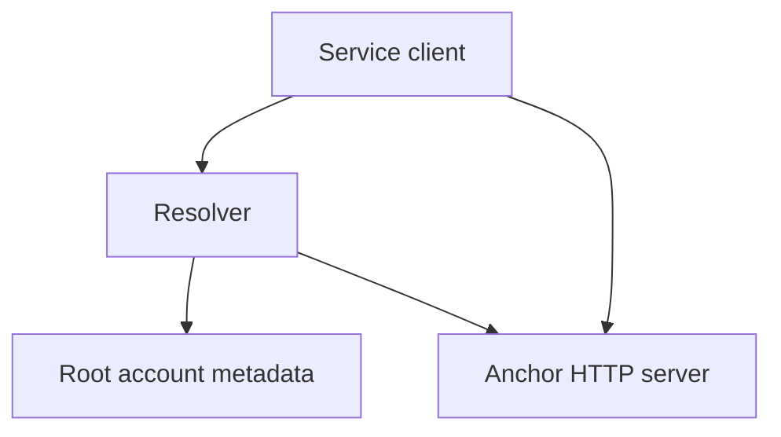

# Overview

## Abstract

This guide is the cultural map for `@keetanetwork/anchor`. It shows what an Anchor is in this codebase. Invariant detail lives on [Architecture](ARCHITECTURE.md) and the concept pages.

## Purpose

Read this guide in the first week on the package. After reading, an engineer can name the approach that a given module follows. The engineer can also find the page that holds each inbound invariant.

| Next question | The page |
| --- | --- |
| What is always true, and where is it enforced? | [Architecture](ARCHITECTURE.md) |
| How does a client find a service? | [Resolver](concepts/resolver.md) |
| How do KYC attributes stay private until share? | [Certificates](concepts/certificates.md) |
| How are bytes encrypted to principals? | [Encrypted containers](concepts/encrypted-containers.md) |
| How does an HTTP request carry a URL signature? | [Signed URLs](concepts/signed-urls.md) |
| How does staged work survive a crash? | [Queue](concepts/queue.md) |
| Which transfer states are standardized? | [Status](concepts/status.md) |
| How does a wallet fold on-chain history? | [History](concepts/history.md) |
| How do service client, server, and common split? | [Services](concepts/services.md) |
| How does a reader install and call a client? | [Quickstart](QUICKSTART.md) |
| How does a writer review a page in this tree? | [Documentation Standard](STANDARD.md) |

## What an Anchor is

An Anchor bridges the logical realm and the physical realm. The logical realm is the KeetaNet ledger. The physical realm is a bank rail, a payment network, or another off-ledger system of record.

This package is the reference Anchor SDK and the Anchor Client. The SDK is the set of tools that build Anchors. The Client is the set of tools that call Anchors.

The product contract is the following set.

- Service discovery through on-chain metadata. See [Resolver](concepts/resolver.md).
- Signed HTTP calls from a client to a service. See [Services](concepts/services.md) and [Signed URLs](concepts/signed-urls.md).
- KYC certificates and encrypted share containers. See [Certificates](concepts/certificates.md) and [Encrypted containers](concepts/encrypted-containers.md).
- Durable queue work for a service process. See [Queue](concepts/queue.md).
- A provider-independent transfer status surface. See [Status](concepts/status.md).
- Wallet history folded from blocks and anchor transfers. See [History](concepts/history.md).

`@keetanetwork/asset-movement-anchor-sdk` is a separate movement package. That package sits on this one. This repository does not own mailbox, saga, or journal concepts.

## How the pieces fit together

A client looks up a service through `Resolver` in `src/lib/resolver.ts`. The resolver reads metadata from one or more root accounts. The client then calls the HTTP operations that the metadata names.

The public client entry is `src/client/index.ts`. That file exports the `KYC`, `FX`, `AssetMovement`, `Username`, and `Notification` namespaces. It also exports `lib` and `KeetaNet`. A `Storage` client exists under `src/services/storage` and is not on that entry. The source is the export list. This guide does not copy it.

The `lib` barrel in `src/lib/index.ts` re-exports certificates, the resolver, URIs, encrypted containers, anchor-external envelopes, transfer status, and user history. Queue drivers, the HTTP server, and chaining live under `src/lib/` for service processes. They are not on that barrel.

## Design approach

### Library first, and the surfaces adapt

**The rule.** Domain logic lives in a library. The HTTP surface adapts to it.

**In this package.** Certificate rules, resolver rules, queue rules, and status rules live under `src/lib/`. A service server under `src/services/*/server.ts` adapts those rules to routes. A service client under `src/services/*/client.ts` adapts them to callers.

### One interface, many drivers

**The rule.** The interface carries the semantic contract. The driver keeps its physical form private.

**In this package.** `KeetaAnchorQueueStorageDriver` in `src/lib/queue/index.ts` is the queue contract. Memory, file, Firestore, Postgres, Redis, and SQLite3 drivers implement it. [Queue](concepts/queue.md) holds that contract.

### One place encodes, and one place decodes

**The rule.** Each serialize pair has one owner.

**In this package.** A service `common.ts` owns the request signable and the response guard. `AnchorExternal` in `src/lib/anchor-external.ts` owns the on-chain envelope. `URI` in `src/lib/uri.ts` owns the `keeta:` action string. A route handler does not parse those forms.

### Persistent state is a contract with the future

**The rule.** Version a schema, and keep an identity stable.

**In this package.** Resolver metadata requires `version` `1`. A queue `id` is the durable job key. A globally identifiable username is `name$providerID` in `src/services/username/common.ts`. A change to those string forms is a breaking migration.

### Honest states

**The rule.** Name the real states, and document the ones that stay provider-specific.

**In this package.** `isCompletedTransferStatus` in `src/lib/anchor-status.ts` treats only `COMPLETE` as settled. Other status strings stay provider-specific. [Status](concepts/status.md) holds that contract.

### Typed errors, and an untested property is unguaranteed

**The rule.** Code errors so a caller can branch. Cite the test that encodes an invariant.

**In this package.** `KeetaAnchorError` in `src/lib/error.ts` is the shared error base. Queue compare-and-set failures raise `Errors.IncorrectStateAssertedError` in `src/lib/queue/common.ts`. The tests under `src/` are the enforcement point.

### Make owns the build

**The rule.** Keep the Make graph correct. Prefer `make test` and `make do-lint`.

**In this package.** The [package README](../README.md) and the `Makefile` drive install, lint, test, and release. Node follows `package.json` `engines.node`. `make` writes `.nvmrc` from that pin.

## Secure programming, how it shows up here

An Anchor handles funds in motion. It also handles personal data and bank instructions.

| Tactic | Example in this package |
| --- | --- |
| Exclusion | Debug logs record identifiers. They do not record raw certificate attribute values. |
| Encapsulation | `EncryptedContainer` in `src/lib/encrypted-container.ts` shares bytes with named principals. See [Encrypted containers](concepts/encrypted-containers.md). |
| Earmarking | `SensitiveAttribute` in `src/lib/sensitive-attribute.ts` marks a KYC field as a commitment. |
| Encryption and authentication | Clients sign HTTP requests. See [Signed URLs](concepts/signed-urls.md). Servers MAY require an on-chain certificate chain. |
| Integrity | Queue compare-and-set and idempotent keys stop a crash retry from adding a second job. |
| Availability trade-offs | Queue leases, retries, and stuck detection bound the work. |

## Contracts a change must not casually break

Each surface below binds somebody outside the change. The owning page or source carries the detail.

| The surface | Who depends on it | Where the detail lives |
| --- | --- | --- |
| The client barrel namespaces | Every published consumer | `src/client/index.ts` |
| Resolver metadata version and lookup | Every service client | [Resolver](concepts/resolver.md) |
| Signed HTTP query fields | Every authenticated caller | [Signed URLs](concepts/signed-urls.md) |
| KYC certificate attributes and share proofs | KYC providers and wallets | [Certificates](concepts/certificates.md) |
| Encrypted container principals and factories | Callers that share private bytes | [Encrypted containers](concepts/encrypted-containers.md) |
| Queue driver and pipe statuses | Service workers | [Queue](concepts/queue.md) |
| `COMPLETE` as the only settled status | Wallets and history | [Status](concepts/status.md) |
| History classifier order and trust rule | Wallet transaction lists | [History](concepts/history.md) |
| The `keeta:` URI send form | Wallets that encode a payment | `src/lib/uri.ts` |
| The Anchor HTTP metadata surface | Every client of an Anchor | [Services](concepts/services.md) |

A change to one of these surfaces is a migration, not a refactor.

## Where the tree lives

[Architecture](ARCHITECTURE.md) names the consumer boundary and the process split. The source is the home for barrels and directory listings.

Service implementations live under `src/services/`. Shared library code lives under `src/lib/`. In-repository tests live next to the modules they prove.

## Day-to-day

### Tooling

- The Node engine follows `package.json` and the generated `.nvmrc`.
- Run `make`, `make do-lint`, and `make test`.
- Private `@keetanetwork/*` packages need a GitHub personal access token.

### Where to put work

| Change | Place |
| --- | --- |
| A new exported service client | `src/services/<name>/`, then `src/client/index.ts` |
| A new resolver service kind | `src/lib/resolver.ts` and the service `common.ts` |
| A KYC attribute or share rule | `src/lib/certificates.ts` and the KYC generated schema |
| An encrypted container rule | `src/lib/encrypted-container.ts` |
| A signed URL query field | `src/lib/http-server/common.ts` |
| A queue driver or status | `src/lib/queue/` |
| A status vocabulary | `src/lib/anchor-status.ts`. Treat the change as breaking. |
| A history classifier | `src/lib/history.ts`. Treat the change as breaking. |
| A documentation page | This tree, then the next-question table on this guide. Writers follow [Documentation Standard](STANDARD.md). |

### First-week reading order

1. This guide.
2. [Architecture](ARCHITECTURE.md), then [Resolver](concepts/resolver.md), [Services](concepts/services.md), [Signed URLs](concepts/signed-urls.md), [Certificates](concepts/certificates.md), [Encrypted containers](concepts/encrypted-containers.md), [Queue](concepts/queue.md), [Status](concepts/status.md), and [History](concepts/history.md).
3. [Quickstart](QUICKSTART.md).
4. `src/client/index.ts` and `src/lib/index.ts`.
5. One complete client test, such as `src/services/kyc/client.test.ts` or `src/services/username/client.test.ts`.

## Cultural one-liners

- **Library first.** The resolver, certificates, queue, and status types are the product. The routes are adapters.
- **The client barrel is the consumer boundary.** A module that is not on it is not a published client.
- **Only `COMPLETE` is settled.** Other status strings belong to the provider.
- **Metadata version 1 is required.** An unknown version is not a service.
- **Classify errors.** An untyped throw is unfinished work.
- **Make owns the build.** Prefer `make test` and `make do-lint`.
- **Everyone is the security person.** Funds and personal data move through this process.

## Falsified by

- A change to the published client namespaces on `src/client/index.ts`.
- A change to the published `lib` barrel on `src/lib/index.ts`.
- A change to the published documentation map that the first-week links follow.
- A change to the set of surfaces that bind a consumer or an operator.
