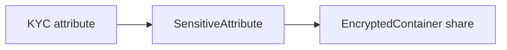

# Certificates

## Abstract

An Anchor KYC certificate extends a KeetaNet X.509 certificate with named attributes. Sensitive attributes stay committed until a share container grants a principal access.

## Purpose

Read this page when a certificate attribute cannot be read, or when a share proof fails. After reading, an engineer can name the owner of encoding, encryption, and the HTTP chain gate.

## Related documents

- [Services](services.md) for the KYC client and server.
- [Encrypted containers](encrypted-containers.md) for the container that holds a share.
- [Resolver](resolver.md) for the KYC `ca` field in metadata.



## Certificate and builder

`Certificate` and [`CertificateBuilder`](https://github.com/KeetaNetwork/anchor/blob/cursor/anchor-repository-docs-eff6/src/lib/certificates.ts#L457-L457) in `src/lib/certificates.ts` extend the KeetaNet certificate types. The builder maps a public `subject` onto the library `subjectPublicKey`.

`setAttribute` writes a KYC attribute and requires a `sensitive` flag. A sensitive value is encoded as a `SensitiveAttribute` commitment for the subject.

[`setSensitiveAttribute`](https://github.com/KeetaNetwork/anchor/blob/cursor/anchor-repository-docs-eff6/src/lib/certificates.ts#L531-L542) accepts a pre-built `SensitiveAttribute`. The attribute public key MUST match the builder subject. A mismatch throws.

`Certificate.getAttributeValue` decrypts a sensitive attribute with the subject key. A missing name throws.

Attribute names and ASN.1 schemas come from `src/services/kyc/iso20022.generated.ts`. The source is the name list. This page does not copy it.

`src/lib/certificates.test.ts` builds, decodes, and shares attributes.

## Encrypted share

[Encrypted containers](encrypted-containers.md) is the home for `EncryptedContainer`.

`SharableCertificateAttributes` in `src/lib/certificates.ts` stores a certificate, optional intermediates, and selected attribute proofs inside one container. [`fromCertificate`](https://github.com/KeetaNetwork/anchor/blob/cursor/anchor-repository-docs-eff6/src/lib/certificates.ts#L835-L838) builds the container. `export` requires at least one principal.

A share proof for a sensitive attribute must validate against the certificate commitment. A plain attribute must match the certificate bytes.

The container is the share format. The certificate remains the authority for what was issued.

```typescript
const fullName = await SensitiveAttribute.create(subject, 'fullName', 'John Doe');
certificateBuilder.setSensitiveAttribute('fullName', fullName);
```

[`SensitiveAttribute.create`](https://github.com/KeetaNetwork/anchor/blob/cursor/anchor-repository-docs-eff6/src/lib/sensitive-attribute.ts#L485-L485) in `src/lib/sensitive-attribute.ts` builds the commitment. [`kyc/client.test.ts`](https://github.com/KeetaNetwork/anchor/blob/cursor/anchor-repository-docs-eff6/src/services/kyc/client.test.ts#L106-L121) issues that path, then [`getCertificates`](https://github.com/KeetaNetwork/anchor/blob/cursor/anchor-repository-docs-eff6/src/services/kyc/client.test.ts#L257-L275) reads it back.

## HTTP certificate-chain gate

[`KeetaAnchorHTTPServerConfig.requireCertificateChain`](https://github.com/KeetaNetwork/anchor/blob/cursor/anchor-repository-docs-eff6/src/lib/http-server/index.ts#L75-L75) in `src/lib/http-server/index.ts` is optional. When set, an authenticated caller MUST present an on-chain chain that terminates at a trusted issuer.

`verifyAccountCertificateChain` in `src/lib/utils/certificate-network.ts` returns `trusted`, `no-certs`, or `untrusted`. `src/lib/utils/certificate-network.test.ts` encodes those outcomes.

## Falsified by

A change to subject matching on `setSensitiveAttribute`, to share-proof validation, or to the HTTP `requireCertificateChain` gate.
