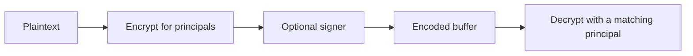

# Encrypted containers

## Abstract

`EncryptedContainer` encrypts bytes to a set of principals and optionally signs the result. This page is the home for that container. KYC share rules live on [Certificates](certificates.md).

## Purpose

Read this page when a principal cannot open a container, or when a remote document stays encrypted. After reading, an engineer can name the factory that produced the buffer and the principal that opens it.

## Related documents

- [Certificates](certificates.md) for `SensitiveAttribute` and `SharableCertificateAttributes`.
- [Status](status.md) for `AnchorExternal` envelopes that wrap a container.

## Principals and factories

[`EncryptedContainer`](https://github.com/KeetaNetwork/anchor/blob/cursor/anchor-repository-docs-eff6/src/lib/encrypted-container.ts#L900-L900) in `src/lib/encrypted-container.ts` is on the `lib` barrel in `src/lib/index.ts`. A non-null principal list encrypts the plaintext. A `null` principal list leaves the payload unencrypted.

[`FromPlaintextOptions`](https://github.com/KeetaNetwork/anchor/blob/cursor/anchor-repository-docs-eff6/src/lib/encrypted-container.ts#L135-L138) MAY set `locked` and `signer`. `locked` defaults to true when principals exist. A `signer` attaches a signature that `verifySignature` later checks.

| Factory | Role |
| --- | --- |
| [`fromPlaintext`](https://github.com/KeetaNetwork/anchor/blob/cursor/anchor-repository-docs-eff6/src/lib/encrypted-container.ts#L988-L1008) | Builds a container from plaintext. |
| [`fromEncryptedBuffer`](https://github.com/KeetaNetwork/anchor/blob/cursor/anchor-repository-docs-eff6/src/lib/encrypted-container.ts#L960-L967) | Opens an encrypted buffer with at least one matching principal. |
| [`fromEncodedBuffer`](https://github.com/KeetaNetwork/anchor/blob/cursor/anchor-repository-docs-eff6/src/lib/encrypted-container.ts#L969-L976) | Opens an encoded buffer. Principals MAY be `null`. |

[`getEncodedBuffer`](https://github.com/KeetaNetwork/anchor/blob/cursor/anchor-repository-docs-eff6/src/lib/encrypted-container.ts#L1347-L1360) returns the serializable form. [`getPlaintext`](https://github.com/KeetaNetwork/anchor/blob/cursor/anchor-repository-docs-eff6/src/lib/encrypted-container.ts#L1325-L1342) returns a copy of the plaintext when access stays enabled. [`grantAccess`](https://github.com/KeetaNetwork/anchor/blob/cursor/anchor-repository-docs-eff6/src/lib/encrypted-container.ts#L1270-L1276) and `revokeAccess` change the principal set after the plaintext is available.



## Call shape

```typescript
const container = lib.EncryptedContainer.fromPlaintext(bytes, [reader], {
	signer: author
});
const encoded = await container.getEncodedBuffer();
const opened = lib.EncryptedContainer.fromEncryptedBuffer(encoded, [reader]);
const plaintext = await opened.getPlaintext();
```

[`Encrypted Container Tests`](https://github.com/KeetaNetwork/anchor/blob/cursor/anchor-repository-docs-eff6/src/lib/encrypted-container.test.ts#L202-L226) encode and decode a single-principal container. [`Encrypted Container Signing Tests`](https://github.com/KeetaNetwork/anchor/blob/cursor/anchor-repository-docs-eff6/src/lib/encrypted-container.test.ts#L450-L508) cover a `signer` that MAY differ from the principal.

## KYC share and remote documents

A KYC share stores selected attribute proofs inside one container. [Certificates](certificates.md) holds that share contract. `SharableCertificateAttributes` in `src/lib/certificates.ts` calls `fromPlaintext` for the proof payload.

A certificate attribute MAY point at remote bytes. [`ExternalReferenceBuilder`](https://github.com/KeetaNetwork/anchor/blob/cursor/anchor-repository-docs-eff6/src/lib/utils/external.ts#L14-L28) in `src/lib/utils/external.ts` builds a URL, content type, digest, and encryption algorithm. The default algorithm is `KeetaEncryptedContainerV1`.

Certificate `$blob` resolution in [`src/lib/certificates.ts`](https://github.com/KeetaNetwork/anchor/blob/cursor/anchor-repository-docs-eff6/src/lib/certificates.ts#L137-L142) fetches that URL. When the algorithm is `KeetaEncryptedContainerV1`, it opens the bytes with `fromEncryptedBuffer` and the certificate principals. [`certificates.test.ts`](https://github.com/KeetaNetwork/anchor/blob/cursor/anchor-repository-docs-eff6/src/lib/certificates.test.ts#L115-L121) builds that path with `ExternalReferenceBuilder`.

`AnchorExternal` in `src/lib/anchor-external.ts` also wraps envelopes in a container. [Status](status.md) holds the envelope contract.

## Falsified by

A change to principal encryption, to the factory trio, to `FromPlaintextOptions.signer`, or to `$blob` decryption of `KeetaEncryptedContainerV1`.
