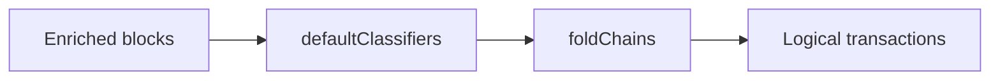

# History

## Abstract

`UserHistory` folds on-chain blocks and optional anchor transfers into wallet-facing rows. This page is the home for classifier order, enrichment trust, and chain fold.

## Purpose

Read this page when a wallet list splits one conversion, or trusts a foreign transfer id. After reading, an engineer can name the classifier or trust rule that produced the row.

## Related documents

- [Status](status.md) for `COMPLETE` and external envelopes.
- [Architecture](../architecture.md) for the invariant table.



## Classifiers

[`defaultClassifiers`](https://github.com/KeetaNetwork/anchor/blob/cursor/anchor-repository-docs-eff6/src/lib/history.ts#L1127-L1133) in `src/lib/history.ts` runs in this order. The first classifier that returns a non-null list wins.

1. Anchor transfer, when enrichment attached a transfer.
2. Atomic swap, SEND and RECEIVE against one counterparty with different tokens.
3. SEND-only.
4. RECEIVE-only.
5. `other`, which always matches.

`foldHistory` pairs accepted cross-block P2P swaps first. It then suppresses foreign staple blocks that a perspective-owned block already covers.

A logical status is `complete` only from a settled block or from a transfer whose status is `COMPLETE`. See [Status](status.md). A raw provider string is preserved on `providerStatus`.

## Enrichment and trust

`UserHistoryListOptions.enrich` defaults to false. Enrichment needs an `AnchorTransactionStatus`.

`#enrichBlock` decodes SEND `external` envelopes locally. It keeps a declared anchor when the block is issued by the perspective, or when the envelope is signed by that anchor. An unsigned foreign block cannot assert a transfer id.

Enrichment prefers the SEND `external`. It then reverse-looks up by on-chain coordinates through `findByOnChain` when the reader supplies that method.

A lone unenriched anchor send or receive is later relabeled `withdraw` or `deposit` and marked `provisional`. That rewrite runs after settlement suppression.

`src/lib/history.test.ts` is the enforcement point for trust, fold, and provisional labels.

## Chain fold

[`foldChains`](https://github.com/KeetaNetwork/anchor/blob/cursor/anchor-repository-docs-eff6/src/lib/history.ts#L1634-L1634) links hops through `refs.inputs` and `refs.blockHashes`. A swap may link to a later swap or bridge. A send may link to a receive. Unenriched local-anchor hops may link to each other.

```typescript
const history = new lib.UserHistory({ history: source });
const rows = await history.list(account);
```

[`UserHistory`](https://github.com/KeetaNetwork/anchor/blob/cursor/anchor-repository-docs-eff6/src/lib/history.ts#L1907-L1907) in `src/lib/history.ts` is the public fold entry. [`foldChains` tests](https://github.com/KeetaNetwork/anchor/blob/cursor/anchor-repository-docs-eff6/src/lib/history.test.ts#L1604-L1608) encode hop linking.

When `HistorySource.getVoteStaple` exists, `UserHistory.iterate` folds chains incrementally and honors `limit`. A source without that method drains, then folds the full set.

`enrichTransaction` re-folds only the blocks that a row already cites.

## Falsified by

A change to `defaultClassifiers` order, to the declared-anchor trust rule, to `foldChains` link rules, or to the `COMPLETE` projection into `LogicalTransactionStatus`.
