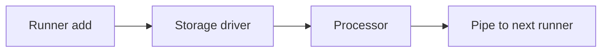

# Queue

## Abstract

The queue persists staged work for a service process. A driver stores rows. A runner claims work, updates status, and pipes finished rows to the next stage.

## Purpose

Read this page when a job is stuck, retried, or missing after a crash. After reading, an engineer can name the status that applies and the driver method that enforces it.

## Related documents

- [Architecture](../architecture.md) for the worker process split.
- [Quickstart](../QUICKSTART.md) for local backend scripts.
- [Services](services.md) for servers that attach a runner.

## Driver contract

[`KeetaAnchorQueueStorageDriver`](https://github.com/KeetaNetwork/anchor/blob/cursor/anchor-repository-docs-eff6/src/lib/queue/index.ts#L120-L153) in `src/lib/queue/index.ts` is the semantic contract. A driver keeps its physical form private.

| Method | Contract |
| --- | --- |
| `add` | Inserts a `pending` row. A duplicate `id` is ignored. Duplicate `idempotentKeys` throw `Errors.IdempotentExistsError`. |
| `setStatus` | Updates one row. `oldStatus` MUST match, or the write throws `Errors.IncorrectStateAssertedError`. |
| `get` / `query` | Return clones. They do not expose live mutable rows. |
| `delete` | Removes a row only when the stored status matches the request. |
| `partition` | Returns a driver view under an extra path segment. |
| `destroy` | Releases backend resources. |

`KeetaAnchorQueueStorageDriverMemory` in the same file is the in-process driver. File, Firestore, Postgres, Redis, and SQLite3 drivers live under `src/lib/queue/drivers/`. Each implements the same interface.

`src/lib/queue/index.test.ts` runs the contract against every available driver. A networked driver skips when its `ANCHOR_TESTING_*` variables are unset.

The queue module is not on the `lib` barrel in `src/lib/index.ts`. Service servers import it from `src/lib/queue/`.

## Runner lifecycle

[`KeetaAnchorQueueRunner`](https://github.com/KeetaNetwork/anchor/blob/cursor/anchor-repository-docs-eff6/src/lib/queue/index.ts#L505-L505) in `src/lib/queue/index.ts` claims `pending` rows, runs `processor`, and writes the result status. [`add`](https://github.com/KeetaNetwork/anchor/blob/cursor/anchor-repository-docs-eff6/src/lib/queue/index.ts#L853-L859) encodes the request and stores it on the driver.

A processor timeout marks the row `aborted`. A row that stays `processing` past `processTimeout * stuckMultiplier` becomes `stuck`. Optional `processorAborted` and `processorStuck` handlers decide the next status. Work MAY already have happened. Those handlers MUST treat the row as indeterminate.

`failed_temporarily` increments `failures`. After `retryDelay`, `maintain` moves the row to `pending`, or to `failed_permanently` when `failures` reaches `maxRetries`.

Only worker id `0` runs the shared maintenance tasks. Every worker refreshes its runner lock. A stale lock is taken over after the stuck threshold.

`KeetaAnchorQueueRunnerJSON` skips encode and decode when the payload is already JSON.

## Pipes and pipelines

A runner MAY [`pipe`](https://github.com/KeetaNetwork/anchor/blob/cursor/anchor-repository-docs-eff6/src/lib/queue/index.ts#L1583-L1583) `completed` output, or `pipeFailed` `failed_permanently` input, to another runner. Batch variants exist. Those two statuses are the only pipeable statuses.

`maintain` moves a row to `moved` only after every registered pipe of that status has accepted it.

[`KeetaAnchorQueuePipelineAdvanced`](https://github.com/KeetaNetwork/anchor/blob/cursor/anchor-repository-docs-eff6/src/lib/queue/pipeline.ts#L95-L95) in `src/lib/queue/pipeline.ts` builds a named stage list on partitioned drivers. [`Queue Runner Basic Tests`](https://github.com/KeetaNetwork/anchor/blob/cursor/anchor-repository-docs-eff6/src/lib/queue/index.test.ts#L440-L440) enqueue through a runner. [`Pipeline Basic Tests`](https://github.com/KeetaNetwork/anchor/blob/cursor/anchor-repository-docs-eff6/src/lib/queue/index.test.ts#L1080-L1080) chain stages. `src/lib/queue/pipeline.test.ts` also exercises add, run, and maintain.

Completed-row cleanup does not run on a runner that has incoming or outgoing pipes. That keeps idempotent ids stable across stages.

## Falsified by

A change to `add` idempotency, to `oldStatus` compare-and-set, to the pipeable status set, to stuck or abort handling, or to worker-0 maintenance ownership.
