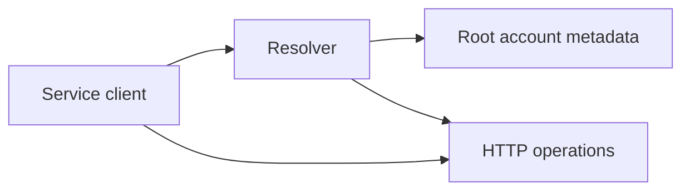

# Resolver

## Abstract

The resolver turns root-account metadata into a set of matching service providers. This page is the home for discovery identity: version, roots, lazy values, and signatures.

## Purpose

Read this page when a client cannot find a provider, or when metadata lookup looks wrong. After reading, an engineer can name the rule that dropped an entry.

## Related documents

- [Architecture](../architecture.md) for the discovery sequence.
- [Services](services.md) for how a client uses lookup results.
- [Signed URLs](signed-urls.md) for signed external metadata fetches.
- [Status](status.md) for transfer reads after a provider is known.



## Root metadata

`Resolver` in `src/lib/resolver.ts` reads metadata from one or more root accounts. The default root is the network account from `getDefaultResolver` in `src/config.ts`.

Each root URL is `keetanet://<publicKey>/metadata`. `Metadata.readKeetaNetURL` in `src/lib/resolver.ts` accepts only that path.

Root metadata MUST carry `version` `1`. A missing version or any other version drops that root. If no root remains, lookup throws.

[`Resolver.Metadata.formatMetadata`](https://github.com/KeetaNetwork/anchor/blob/cursor/anchor-repository-docs-eff6/src/lib/resolver.ts#L954-L954) in `src/lib/resolver.ts` JSON-encodes, deflates, and Base64-encodes the object that an account stores.

## Several roots

A config MAY pass an array of roots. The first entry has the highest priority.

`#mergeRootMetadata` in `src/lib/resolver.ts` walks the array from last to first. A later write overwrites a colliding `currencyMap` key or service id. The first root therefore wins.

A root that fails to load is ignored. The remaining roots still merge.

## Lazy values and external URLs

A metadata field MAY be an external URL object. The resolver fetches that URL when the field is read.

Supported protocols are `keetanet:` and `https:`. `http:` is allowed only when `allowInsecureProtocols` is true.

A circular URL chain returns `null`. `Metadata.readURL` in `src/lib/resolver.ts` tracks the active chain in `seenURLs`.

Positive cache TTL defaults to 60 seconds. Negative cache TTL defaults to 5 seconds. `clearCache` on `Resolver` drops the map and the counters.

## Signatures

`verifyServiceEntrySignature` in `src/lib/resolver.ts` accepts an entry that has neither `account` nor `signed`. It rejects an entry that has only one of those fields.

When both fields are present, the resolver fully realizes `operations` and optional `legal`. It then calls `verifyMetadataSignature` in `src/lib/anchor-metadata-server.ts`.

`extractSignedFields` in `src/lib/anchor-metadata-server.ts` covers `namespace`, `account`, `operations`, and optional `legal`. The namespace is `METADATA_SIGNATURE_NAMESPACE` in that file.

`#filterByAccounts` drops entries whose `account` is missing or outside `SharedLookupCriteria.accounts`. Unsigned entries fail that filter.

`src/lib/resolver.test.ts` publishes signed and unsigned entries and asserts the keep-or-drop result.

## Lookup

`Resolver.lookup` filters by optional `providerIDs` and `accounts`. It then verifies signatures. It then runs the service-specific search.

| Service | Extra criteria home |
| --- | --- |
| `kyc` | Country codes. A provider without `countryCodes` matches every country. |
| `fx` | Input and output tokens, required operations, and affinity. |
| `assetMovement` | Asset, locations, and rails through `filterSupportedAssets`. |
| `username` | No extra filters. |
| `notification` | Channels and subscription types. |
| `storage` | Operations present. No extra filters. |
| `banking` | Currency codes and country codes. |
| `cards` | Not implemented. Lookup throws. |

EVM asset ids in asset-movement metadata are checksummed through `checksumEVMAsset` in `src/lib/asset.ts`. A non-canonical id is normalized and logged once.

## Client construction

Each published client accepts an optional `resolver`. When that field is omitted, the client calls [`getDefaultResolver`](https://github.com/KeetaNetwork/anchor/blob/cursor/anchor-repository-docs-eff6/src/config.ts#L51-L51) in `src/config.ts`. The caller supplies `root` when the metadata lives on an account other than the network account.

## Call shape

```typescript
const metadata = Resolver.Metadata.formatMetadata({
	version: 1,
	services: { /* service map */ }
});
const providers = await resolver.lookup('kyc', { countryCodes: ['US'] });
```

[`lookup`](https://github.com/KeetaNetwork/anchor/blob/cursor/anchor-repository-docs-eff6/src/lib/resolver.ts#L2850-L2850) filters and verifies. [`kyc/client.test.ts`](https://github.com/KeetaNetwork/anchor/blob/cursor/anchor-repository-docs-eff6/src/services/kyc/client.test.ts#L152-L174) publishes that metadata and constructs `KYC.Client`. [`resolver.test.ts`](https://github.com/KeetaNetwork/anchor/blob/cursor/anchor-repository-docs-eff6/src/lib/resolver.test.ts#L382-L382) looks up `banking`, `kyc`, and `fx`.

## Falsified by

A change to metadata version handling, to multi-root merge order, to signature keep-or-drop rules, to supported URL protocols, or to `getDefaultResolver` root selection.
