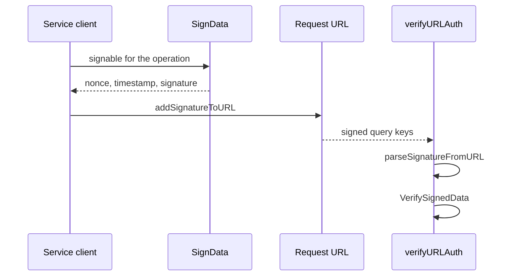

# Signed URLs

## Abstract

An authenticated Anchor HTTP request carries an account signature. This page is the home for the URL query form of that signature. Body authentication and the certificate-chain gate live on [Services](services.md) and [Certificates](certificates.md).

## Purpose

Read this page when a signed request fails to parse or verify. After reading, an engineer can name the query keys and the helper that wrote them.

## Related documents

- [Services](services.md) for client call shape and service signables.
- [Certificates](certificates.md) for the optional on-chain chain gate.
- [Resolver](resolver.md) for signed external metadata URLs.

## Query signature

[`HTTPSignedField`](https://github.com/KeetaNetwork/anchor/blob/cursor/anchor-repository-docs-eff6/src/lib/http-server/common.ts#L13-L19) in `src/lib/http-server/common.ts` holds `nonce`, `timestamp`, and `signature`. [`SignData`](https://github.com/KeetaNetwork/anchor/blob/cursor/anchor-repository-docs-eff6/src/lib/utils/signing.ts#L262-L262) in `src/lib/utils/signing.ts` produces that field.

[`addSignatureToURL`](https://github.com/KeetaNetwork/anchor/blob/cursor/anchor-repository-docs-eff6/src/lib/http-server/common.ts#L28-L50) writes four query keys.

| Query key | Source |
| --- | --- |
| `signed.nonce` | `HTTPSignedField.nonce` |
| `signed.timestamp` | `HTTPSignedField.timestamp` |
| `signed.signature` | `HTTPSignedField.signature` |
| `account` | The signer public key string |

A URL that already has a `signed.*` key causes `addSignatureToURL` to throw.

[`parseSignatureFromURL`](https://github.com/KeetaNetwork/anchor/blob/cursor/anchor-repository-docs-eff6/src/lib/http-server/common.ts#L52-L97) reads those keys. All three `signed.*` keys absent yields no field. A partial set throws. An `account` value becomes a KeetaNet account.



## Call shape

```typescript
const signed = await SignData(account, signable);
const url = addSignatureToURL(endpoint, {
	signedField: signed,
	account: account
});
```

[`SignData` tests](https://github.com/KeetaNetwork/anchor/blob/cursor/anchor-repository-docs-eff6/src/lib/utils/signing.test.ts#L36-L36) encode the field. [`anchor-metadata-server.test.ts`](https://github.com/KeetaNetwork/anchor/blob/cursor/anchor-repository-docs-eff6/src/lib/anchor-metadata-server.test.ts#L68-L68) calls `addSignatureToURL`. Service clients apply the same helper after they build a signable. [Services](services.md) cites those cookbooks.

## URL auth and body auth

[`verifyURLAuth`](https://github.com/KeetaNetwork/anchor/blob/cursor/anchor-repository-docs-eff6/src/lib/http-server/common.ts#L133-L159) parses the URL, verifies the signature, then applies the certificate-chain gate.

[`verifyBodyAuth`](https://github.com/KeetaNetwork/anchor/blob/cursor/anchor-repository-docs-eff6/src/lib/http-server/common.ts#L105-L126) reads `account` and `signed` from the request body. It uses the same `HTTPSignedField` and the same chain gate. The query keys are absent on that path.

The caller supplies the signable. A service `common.ts` owns that signable. See [Services](services.md).

The chain gate is `requireCertificateChain` on `KeetaAnchorHTTPServerConfig` in `src/lib/http-server/index.ts`. [Certificates](certificates.md) holds the trust outcomes.

`Resolver` signs external metadata fetches through `addSignatureToURL` in `src/lib/resolver.ts` when metadata authentication requires a Keeta account.

## Keeta action URIs

`parseKeetaURI` and `encodeKeetaURI` in [`src/lib/uri.ts`](https://github.com/KeetaNetwork/anchor/blob/cursor/anchor-repository-docs-eff6/src/lib/uri.ts#L35-L124) own the `keeta://actions/send` payment form. That form is a ledger action string. It is a different contract from these HTTP query keys. [Architecture](../ARCHITECTURE.md) points at that file.

## Falsified by

A change to the signed query key names, to the add-or-parse throw rules, or to the URL-versus-body verification split.
